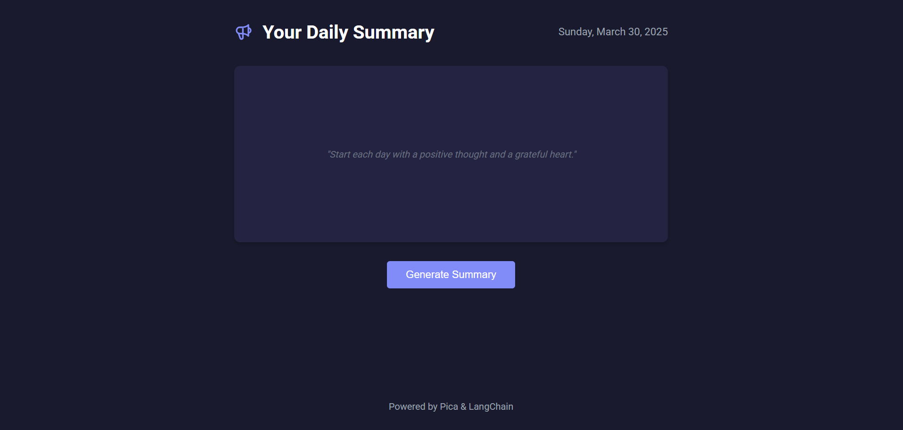

# Daily Briefing Application

A personalized daily briefing AI agent that provides news, weather, and traffic updates through a web interface.



## Prerequisites

- Python 3.8 or higher
- API keys for:
  - OpenAI
  - [PICA](https://www.picaos.com/)
  - ElevenLabs
  - Google Maps

## Setup

1. Clone the repository:

```bash
git clone https://github.com/Harshit-65/Daily-briefing-ai-agent.git
cd Daily-briefing-ai-agent
```

2. Create and activate virtual environment:

```bash
# Windows
python -m venv venv
venv\Scripts\activate

# Linux/Mac
python -m venv venv
source venv/bin/activate
```

3. Install dependencies:

```bash
pip install -r requirements.txt
```

4. Set up environment variables:

```bash
# Copy the example env file
cp .env.example .env

# Edit .env file with your API keys and configuration
```

## Running the Application

1. Start the server:

```bash
python app.py
```

2. Open your browser and visit:

```
http://localhost:3000
```

## Features

- AI technology news updates
- Current weather information
- Traffic information for your commute
- Text-to-speech conversion
- Web interface for easy access

## Environment Variables

Create a `.env` file in the root directory with the following variables (see `.env.example`):

- `OPENAI_API_KEY`: Your OpenAI API key
- `PICA_SECRET_KEY`: Your Pica API key
- `ELEVENLABS_API_KEY`: Your ElevenLabs API key
- `GOOGLE_MAPS_API_KEY`: Your Google Maps API key
- `HOME_ADDRESS`: Your home address for traffic info (e.g "Kharadi, Pune")
- `OFFICE_ADDRESS`: Your office address for traffic info (e.g "Magarpatta, Pune")
- `SLACK_CHANNEL_ID`: Slack channel ID for notifications
- `SLACK_CHANNEL_CONNECTION_KEY`: Slack connection key
- `ELEVENLABS_VOICE_ID`: ElevenLabs voice ID for text-to-speech

```

```
